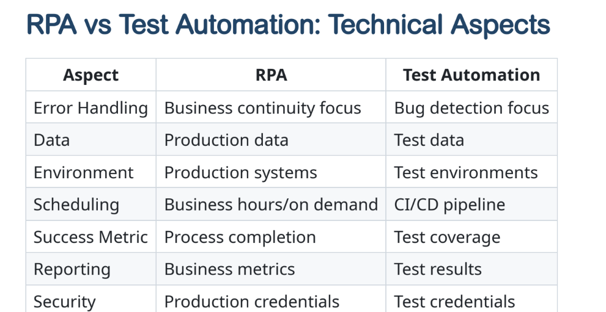

# RPA-Summary

## Importing Required Modules

from robocorp.tasks import task *Imports Robocorp's task decorator (@task), which marks a function as an automation task.*
from robocorp import browser *Imports browser automation features (built on Playwright) for opening, interacting with, and closing web pages.*
from RPA.HTTP import HTTP *Imports the HTTP module, which is used to download files (in this case, an Excel file)*
from RPA.Excel.Files import Files *Imports the Excel module to open, read, and process data from Excel files*
from RPA.PDF import PDF *Imports the PDF module to convert webpage content into a PDF file*

## Defining the main Automation Task

@task
def open_page():

## Configures the browser automation

browser.configure(slowmo=100) *slowmo=100: Adds a 100-millisecond delay to each action for better visibility and debugging*

## Navigating to the Website

browser.goto(url)

## Filling the Search Box

page.locator("#search").fill("Mark Pilgrim : Dive into Python")

## Submitting the Search Form

page.evaluate("document.querySelector('#search').form.submit()")

## Taking a Screenshot

browser.screenshot()

## Logging Into the Music Collection Website

def log_in_to_music_collection():
    page = browser.page()
    page.fill("#username", "student")
    page.fill("#password", "rpa@hamk")
    page.click("button:text('Login')")

## Downloading the Excel File

def download_music_collection_excel():
    http = HTTP()
    http.download(
        url="https://fspacheco.github.io/rpa-challenge/assets/music-collection-sample.xlsx", 
        target_file="music-collection-sample.xlsx",
        overwrite=True
    )

## Filling the Form With Music Collection Data

def fill_form_with_music_collection_data():
    excel = Files()
    excel.open_workbook("music-collection-sample.xlsx")
    worksheet = excel.read_worksheet_as_table("music-collection", header=True)
    excel.close_workbook()
    for entry in worksheet:
        fill_and_submit_music_form(entry)

## Filling and Submitting a Single Entry

def fill_and_submit_music_form(entry):
    page = browser.page()
    page.fill("#artist", entry["Artist"])
    page.fill("#album", entry["Album"])
    page.fill("#year", str(entry["Release Year"]))
    page.select_option("#format", entry["Format"])
    page.select_option("#condition", entry["Condition"])
    page.click("button:text('Add to Collection')")

## Capturing a Screenshot

def capture_collection_screenshot():
    page = browser.page()
    summary_and_list = page.locator("#filledData")
    summary_and_list.screenshot(path="output/music_collection_summary.png")

## Saving the Collection as a PDF

def save_collection_as_pdf():
    page = browser.page()
    collection_list_html = page.locator("#fullMusicCollectionTable").evaluate("element => element.outerHTML")
    pdf = PDF()
    pdf.html_to_pdf(collection_list_html, "output/music_collection.pdf")

## Closing the Browser

def close_music_collection_website():
    page = browser.page()
    page.close()

## What is RPA?

- Robotic Process Automation (RPA) is a technology that uses software robots
("bots") to automate repetitive, rule-based tasks
- These bots interact with digital systems and software just like humans do

## RPA vs Traditional Automation

*Traditional Automation*
- Requires API integration
Examples of APIs: OpenWeatherMap and Open-Meteo
- Often involves changing existing systems
- Less flexible and better for high-volume, stable processes

*RPA*
- Faster to implement than creating an API from zero
- Non-invasive, flexible and adaptable

## RPA vs Test Automation: Key Differences

*RPA automates business processes end-to-end*
- Replaces manual repetitive tasks
- Focuses on production workflo
- Handles real business data

*Test Automation validates software functionality*
- Uses test data and environments
- Focuses on finding defects
- Typically runs in test environments

## RPA and Test Automation: Technical Aspects

  

